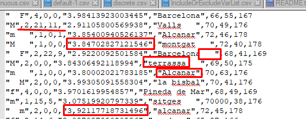

```{r setup, include=FALSE}
knitr::opts_chunk$set(echo = TRUE)
#setwd("C:/Users/solutio/Desktop/Master/Estadística Avanzada/Pec1")
```

```{r load_libraries, include=FALSE}
library(knitr)
library(tidyverse)
library(tools)
library(gridExtra)
library(psych)
library(VIM)
```

## Pregunta 1

1. *Cargar el archivo de datos en R y hacer una breve descripción del archivo donde se indique el número
de registros, el número de variables y los nombres de las variables. Recuerda que antes de cargar el
archivo, se inspeccionará de qué tipo de formato csv se trata para que la lectura sea apropiada.*

Para realizar este apartado primero debemos fijarnos en como se encuentra el csv inicialmente para observar el separador que utiliza. En este caso se observa como se utiliza un separador por comas.



Por otro lado, tambíen se observan distintos problemas en un vistazo inicial, como separadores decimales por comas, ciudades que empiezan por mayúscula o minúscula, espacio en los extremos de las palabras...

Por ahora se va a cargar el csv con el separador para limpiar preprocesar los datos que nos encontremos.

```{r}
dataDf <- read.csv('Fumadores_raw.csv', stringsAsFactors = FALSE)
head(dataDf)
```

Se observa como al cargar el fichero ciertas variables se cargan con clases que no les corresponde, como PC que se carga como tipo character debido a las comas que se encuentran dentro de estos valores.

Se va a realizar una pequeña exploración utilizando la función `str`:

```{r}
str(dataDf)
```

Con este código podemos observar la estructura del objeto en R, se trata de un dataframe de 300 observaciones y 9 variables. Para ayudar a la compresión de los datos se va a realizar un "diccionario" de las variables que nos aporte el significado de cada variable:

* **Sex**: sexo de la persona entrevistada
* **Sport**: escala de la cantidad de deporte realizado, de 1 a 4.
* **Years**: años como fumador
* **Cig**: cantidad de cigarrillos
* **PC**: medida FEF 
* **City**: ciudad de residencia
* **Weight**: peso de la persona entrevistada
* **Age**: edad de la persona entrevistada
* **Height**: altura de lapersona entrevistada


## Pregunta 2

2. *Indicar el tipo de variable estadística de cada variable*

Vamos a ver un pequeño ejemplo de los datos para clasificarla según su tipo de variable:

```{r}
head(dataDf)
apply(dataDf,2, class)
```

* **Sex**: categorica-nominal, solo debe de tomar los valores M o F
* **Sport**: categorica-ordinal, se trata de una escala ordenada, de menos a más
* **Years**: cuantitativa-discreta, dado que solo se toman años enteros y que no existen edades negativas
* **Cig**: cuantitativa-discreta, solo se toma una cantidad de cigarrillos enteros y que no existe una cantidad negativa de cigarrillos
* **PC**: cuantitativa-continua al tratarse de un cociente de litros por segundo y poder tomar valores intermedios
* **City**: categorica-nominal al tratarse de ciudades no existe una ordenación
* **Weight**: cuantitativa-continua a pesar de que se encuentre redondeada, puede tomar valores decimales
* **Age**: cuantitativa-discreta toma valores enteros
* **Height**: cuantitativa-continua se encuentra redondeada pero podría incluir valores de milímetros como decimales

**Nota:** dentro de las variables, algunas cuantitativas discretas podrían considerarse como continuas, por ejemplo un 1.5 en years podría considerarse como año y medio (365 * 1.5 días), sin embargo se van a tratar como variables  cuantitativas-discretas.

## Pregunta 3

3. *En caso que R no asigne el tipo apropiado a alguna variable, realizar la conversión necesaria para que el
tipo final de cada variable sea adecuado. Como por ejemplo, posibles errores de variables cuantitativas
con confusión de separador decimal.*

En este apartado nos podemos encontrar con que la variable "PC" se le ha asignado una clase character cuando debe de ser numérica (las otras variables de tipo chr se mantienen así hasta realizar las transformaciones apropiadas). Por ello vamos a comenzar la transformación para adecuarlo al punto, para ello se va a sustituir todas las apariciones comas por puntos, dado que se verifica que NO existe un separador de millares, en este caso si intentaramos transformarlo directamente a numérico se introducirían NAs

**ANTES**

```{r}
head(dataDf$PC, 25)
```

**DESPUÉS**

```{r}
dataDf$PC <- as.numeric(gsub(pattern = ',',replacement = '.', dataDf$PC))
head(dataDf$PC, 25)

```


## Pregunta 4

4. *Normalizar / Estandarizar variables cuantitativas* 

Dado que hemos definido de que variables se tratan, vamos a identificarlas en un vector para realizar la limpieza (y aprovechamos y nos creamos el vector con las categóticas):
```{r}
numericalVariables <- c('Years', 'Cig', 'PC', 'Weight', 'Age', 'Height')
categoricalVariables <- names(dataDf)[!names(dataDf) %in% numericalVariables]
```


Estandarizamos la variable PC a tres cifras decimales (ya tiene el separador decimal a punto):
```{r}
dataDf$PC <- round(dataDf$PC,3)
head(dataDf$PC, 25)
```

En el resto de las variables no se necesita realizar un redondeo dado que se tratan de variables sin valores decimales.

## Pregunta 5

5. *Normalizar / Estandarizar variables cualitativas*

Para la variable `Sex` se va a proceder a estandarizarlo a valores de M y F, si hacemos una previsualización, se puede observar como no todas están en mayúsculas y varias contienen espacios:

```{r}
head(dataDf$Sex)
```

Para eliminar los espacios utilizaremos `trimws()`, mientras que para ponerlo en mayúsculas `toupper()`

```{r}
dataDf$Sex <- toupper(trimws(dataDf$Sex))
head(dataDf$Sex, 25)
```

Por otro lado para poner la primera letra como mayúscula se va a utilizar la función `toTitleCase()` incluida en el paquete base `tools`, además se eliminarán los espacios para `City` al igual que en `Sex`:

```{r}
dataDf$City <- toTitleCase(trimws(dataDf$City))
head(dataDf$City, 25)
```

**Nota:** la palabra "De" también se incluye en mayúscula la primera letra, al no indicarse en los criterios de la actividad el NO realizarlo en preposiciones. En este caso se podría realuzar un `gsub()` que lo modifique (en otros casos se podría utilizar un diccionario de palabras para sustituirlas).

Para facilitar el mapeo de los nuevos valores en `Sport` se va a transformar a factor (ordered) para utilizar las funciones base de esta clase

```{r}
dataDf$Sport <- as.ordered(dataDf$Sport)
levels(dataDf$Sport)
```

Ahora se pueden cambiar directamente los niveles por las letras equivalentes
```{r}
levels(dataDf$Sport) <- c('N', 'S', 'R', 'E')
levels(dataDf$Sport)
is.ordered(dataDf$Sport)
head(dataDf$Sport, 10)
```

Una vez normalizados y estandarizados las variables se transforman en factor

```{r}
dataDf$Sex <- as.factor(dataDf$Sex)
levels(dataDf$Sex)
dataDf$City <- as.factor(dataDf$City)
levels(dataDf$City)

```

El dataset queda de la siguiente manera


```{r}
head(dataDf)
```
```{r}
str(dataDf)
```

## Pregunta 6

6. *Revisar posibles inconsistencias entre variables: Years vs Cig.*

Para ello se van a identificar aquellas observaciones que cumplen con las inconsitstencias, fumadores sin cigarrillos o no fumadores con cigarrillos:


**Caso 1**
```{r}
head(dataDf[dataDf$Cig == 0 & dataDf$Years > 0 ,])
dataDf[dataDf$Cig == 0 & dataDf$Years > 0 ,c('Cig', 'Years')] <- 0
```
```{r}
head(dataDf[dataDf$Cig == 0 & dataDf$Years > 0 ,])
dataDf[35,]
```

**Caso 2**
```{r}
head(dataDf[dataDf$Cig > 0 & dataDf$Years == 0 ,])
dataDf[dataDf$Cig > 0 & dataDf$Years == 0 ,c('Cig', 'Years')] <- 0
```

```{r}
head(dataDf[dataDf$Cig > 0 & dataDf$Years == 0 ,])
dataDf[9,]
```

## Pregunta 7

7. *Buscar valores atípicos en las variables cuantitativas*

    i) *Presentar un boxplot para cada variable cuantitativa.*
    ii) *Realizar un cuadro con las estimaciones robustas y no robustas de tendencia central y dispersión
para cada variable cuantitativa*

```{r fig.height=10, fig.width=7}

  g1 <- ggplot(dataDf, aes(x = 'Years', y = Years)) +
                      geom_boxplot() +
                      theme_bw()
  g2 <- ggplot(dataDf, aes(x = 'Cig', y = Cig)) +
                      geom_boxplot() +
                      theme_bw()
  g3 <- ggplot(dataDf, aes(x = 'PC', y = PC)) +
                      geom_boxplot() +
                      theme_bw()
  g4 <- ggplot(dataDf, aes(x = 'Weight', y = Weight)) +
                      geom_boxplot() +
                      theme_bw()
  g5 <- ggplot(dataDf, aes(x = 'Age', y = Age)) +
                      geom_boxplot() +
                      theme_bw()
  g6 <- ggplot(dataDf, aes(x = 'Height', y = Height)) +
                      geom_boxplot() +
                      theme_bw()
  
  grid.arrange(g1, g2, g3, g4, g5, g6, nrow = 3, ncol = 2)
```

Notas sobre los resultados de los boxplots:

  * Years: la mayor parte de los integrantes no fuman y los fumadores se encuentran más concentrados entre los 15 para abajo, por otro lado se encuentran outliers de personas que han fumado durante más de 35+ años, lógico cuando se piensa en la nocividad del tabaco y su repercusión en la salud.
  * Cig: Al encontrarse relacionado con `Years` se observa un resultado muy similar donde lo normal es el consumo de menos de un paquete diario (20 cigarrillos) y raros casos en los que se fuma más de paquete y medio.
  * PC: esta variable se encuentra bien distribuida donde la mayoría de datos se encuentran centrados en la mediana, a pesar de observarse una dispersión mayor para los valores menores. Por otro lado se encuentran outliers para personas con un PC muy bajo.
  * Weight: en esta variable se encuentra una gran discordancia entre valores, esto puede deberse a las medidas realizadas en esta observación, en este caso se ha tomado el valor del peso en gramos para algunas observaciones, multiplicando el valor por 1000, por lo que habrá que solucionarlo
  * Age: valores con una buena distribución centrafa sobre los ~45 años
  * Height: altura centrada en los ~173 centímetros
  
Modificación de valores atípicos en `Weight`, considerando los valores por encima de 400 como atípicos
```{r}
dataDf$Weight[dataDf$Weight > 500] <- dataDf$Weight[dataDf$Weight > 500]/1000
ggplot(dataDf, aes(x = 'Weight', y = Weight)) +
                      geom_boxplot() +
                      theme_bw()
```

Ahora se puede observar como no se encuentran valores atípicos corregidos.


Para realizar el estudio se va a definir una función que nos devuelva los valores del estudio y se utilizará dentro de un sapply
```{r}
performEstimations <-  function(variable, trim){
  variable <- variable[!is.na(variable)]
  media <- mean(variable)
  media_recortada <- mean(variable, trim = trim)
  media_winsorizada <- winsor.mean(variable, trim = trim)
  mediana <- median(variable)
  desviacion_estandar <- sd(variable)
  DAM <- mad(variable)
  RIC <- IQR(variable)
  
  return(data.frame(media, media_recortada, media_winsorizada,
                    mediana, desviacion_estandar, DAM, RIC))
}
```

```{r}
cuadro <- sapply(numericalVariables, function(x){
  performEstimations(dataDf[[x]], trim = 0.05)
})
cuadro
```

## Pregunta 8

8. *Valores perdidos*

    i) *Buscar qué variables y registros tienen valores perdidos*
    ii) *Imputar los valores a partir de los k-vecinos más cercanos usando la distancia de Gower con la
información de todas las variables*

Para buscar que variables tienen NAs se utilizará la función por defecto de R, `is.na()`

```{r}
apply(dataDf, 2, function(x) sum(is.na(x)))
```

En este caso solo la variable PC contiene NAs, concretamente dos, para imputarlos se va a utilizar la función `NN()` del paquete `VIM`

```{r}
dataDf$PC <- kNN(dataDf)$PC
head(dataDf$PC,10)
apply(dataDf, 2, function(x) sum(is.na(x)))
```

## Pregunta 9

9. *Hacer un breve estudio descriptivo de los datos una vez depurados*

Veamos con un pequeño estudio como quedan las cosas

```{r}
str(dataDf)
```

En este momento se observa como cada variable tiene la clase que le corresponde según si se trata de una variable cuantitativa o categórica.

```{r}
summary(dataDf)
```

Se observa lo siguiente:

 * El conjunto de datos tiene una mayor participación masculina
 * La mayor parte no realiza ejericio o muy poco
 * La mayor parte de los encuestados son no fumadores
 * La ciudad con mayor participación es Barcelona
 * El peso se encuentra dentro de las posibilidades de peso para hombres y mujeres
 * La encuesta se ha realizado sobre personas de más de 18 años
 * La altura se encuentra en valores posibles de la altura
 
Por otro lado en un futuro se podría estudiar la diferencia entre los fumadores y no fumadores, como por ejemplo:

```{r fig.height=10, fig.width=7}

  esFumador <- dataDf$Years
  esFumador[esFumador>0] <- 1
  esFumador <- as.factor(esFumador)

  g1 <- ggplot(dataDf, aes(x = esFumador, y = Years, fill = esFumador)) +
                      geom_boxplot() +
                      theme_bw()
  g2 <- ggplot(dataDf, aes(x = esFumador, y = Cig, fill = esFumador)) +
                      geom_boxplot() +
                      theme_bw()
  g3 <- ggplot(dataDf, aes(x = esFumador, y = PC, fill = esFumador)) +
                      geom_boxplot() +
                      theme_bw()
  g4 <- ggplot(dataDf, aes(x = esFumador, y = Weight, fill = esFumador)) +
                      geom_boxplot() +
                      theme_bw()
  g5 <- ggplot(dataDf, aes(x = esFumador, y = Age, fill = esFumador)) +
                      geom_boxplot() +
                      theme_bw()
  g6 <- ggplot(dataDf, aes(x = esFumador, y = Height, fill = esFumador)) +
                      geom_boxplot() +
                      theme_bw()
  
  grid.arrange(g1, g2, g3, g4, g5, g6, nrow = 3, ncol = 2)
```

## Pregunta 10

10. *Finalmente, crear el archivo de datos corregido*

```{r}
write.csv(dataDf, file = 'mellizoSoto_Fumadores_clean.csv', row.names = FALSE)
```

